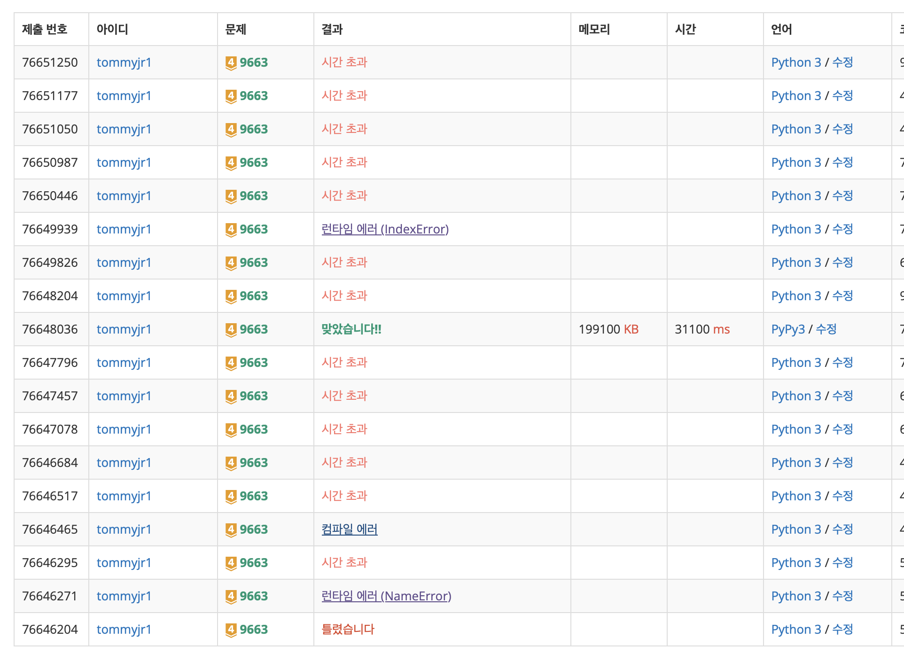

# BackTracking

DFS 방식처럼 State Space Tree를 깊이우선으로 탐색하는데,

- 자식 노드로 내려갈때마다
  **Promising**한 노드로 내려가고,
- 만약 이 노드가 자격이 없다면,
  **Pruning**을 진행해, 부모노드로 다시 올라가서 다른 가지치기를 진행.

## Code

재귀함수 사용하는 편.

# 백트래킹은 백준이나 프로그래머스에서 시간초과가 잘된다.

코테는 감안해서 줄것으로 예상.


Look at my 삽질;

```py
import sys
input = sys.stdin.readline
n = int(input())

ans = 0
#가로줄에 퀸 하나니까
row = [0] * n

#재귀함수
def n_queens(x):
    global ans
    if x == n:
        ans += 1
        return

    else:
        for i in range(n):
            # [x, i]에 퀸을 놓겠다.
            row[x] = i
            if is_promising(x):
                n_queens(x+1)

#promising함수
def is_promising(x):
    for i in range(x):
        # 같은 세로열이면 안됨.
        # 대각선 라인에 있으면 안됨.
        if row[x] == row[i] or abs(row[x] - row[i]) == abs(x - i):
            #이전 단계로 돌아가서 pruning 하게됨.
            return False

    return True

n_queens(0)
print(ans)
```

1. 함수 선언 순서는 상관이 없다.

   함수가 진짜로 호출될 때만, 선언들이 다 되었다면 섞이지 않음.

2. 전역변수 사용

   함수 선언 전에 변수들을 다 선언해두어야.<br>
   그러고 global a를 함수선언 시 넣으면 전역변수가 됨.

3. 맵 상에서 대각선에 위치하는 경우

   (x1,y1), (X2, Y2) -> **abs(x1-x2) = abs(y1-y2)**

## 문제 유형

**맵찾기 - 여러 경우의수 모두 시뮬**<br>

최적화 문제, 결정 문제에서 많이 사용<br>
미로 찾기 / n-Queen 문제 / Map coloring / 부분 집합의 합 등<br>

[백준 n-Queen](https://www.acmicpc.net/problem/9663)

- 당연히 생각해야 하는것: 한줄에 퀸은 한줄만 입력이 된다.

  이런 생각을 당연하게 해서 조건을 줄여야 BT을 할 이유가 됨.

- DFS라고 꼭 스택으로 만들 필요 없음.

  얘는 행 별로 1개만 넣으면 되어서, 스택에 넣다 뺏다 하지않고 값을 계속 바꿔줌.

- 삽질 미치게 해서 외움. 굳.

[백준 n-m](https://www.acmicpc.net/problem/15649)

- 백트래킹 질려서 나중에 다시볼래.
